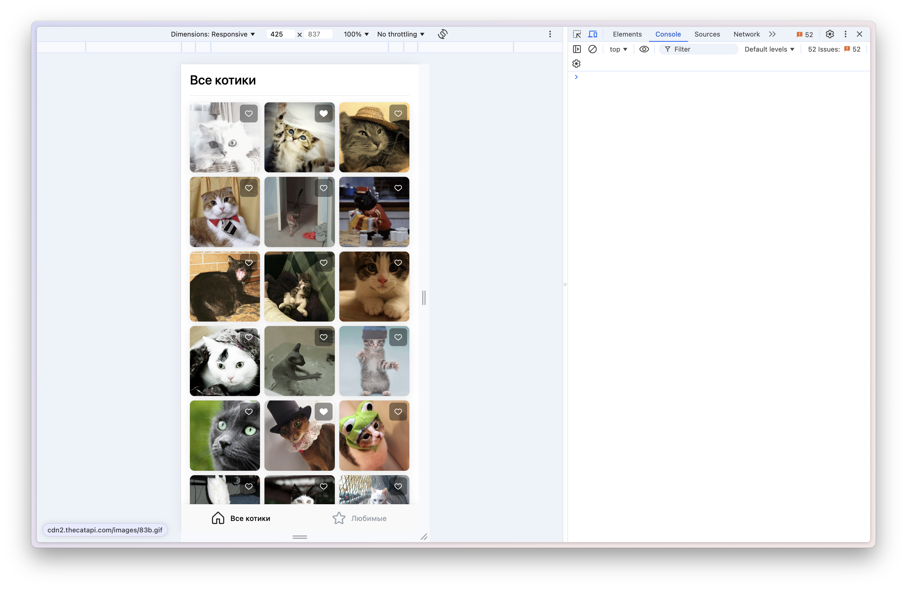
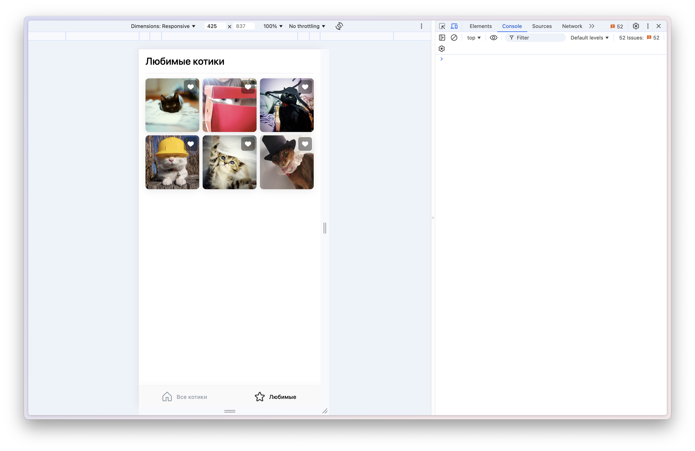
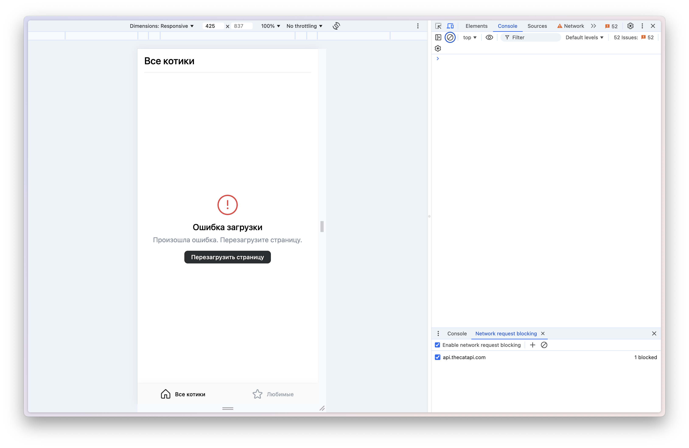

# Комментарий от разработчика

Привет! Это выполненное профильное задание для стажировки на роль "[Frontend-разработчик мини-приложений](https://internship.vk.company/vacancy/1057)"

## Демо
[Ссылка](https://prod-app52936580-a2a6271475a9.pages-ac.vk-apps.com/index.html)

Если не будут отображаться фотографии, используйте VPN.

## Скриншоты

### Все котики

### Любимые котики

### Страница неудачного обращения к API

## Какие библиотеки используются
1. [react js](https://react.dev/)
2. [vkui](https://dev.vk.com/ru/libraries/vkui)
3. [icons](https://github.com/VKCOM/icons)
4. [vk-mini-apps-router](https://dev.vk.com/ru/libraries/router)
5. [vk-mini-apps-deploy](https://github.com/VKCOM/vk-miniapps-deploy)

# Задание для Front-end стажёра

Привет! Если ты хочешь стать частью команды Учи.ру в рамках стажёрской программы, 
то тебе необходимо выполнить небольшое тестовое задание. Это нужно, что бы твои 
потенциальные наставники смогли оценить твои навыки и сравнив их с остальными
кандидатами выбрать лучших из лучших. 

Помни, что работающий продукт важнее количества технологий и красивого кода. 

Удачи!

## Что нужно сделать ?

- форкнуть этот репозитарий в свой github аккаунт
- реализовать проект по описанию ниже
- опубликовать его на github pages
- прислать нам свой гитхаб аккаунт и ссылку на опубликованный сайт
- ждать обратной связи :)

## Проект "Кошачий пинтерест"

Необходимо реализовать интерфейс для просмотра котиков используя API https://thecatapi.com

Дизайн лежит тут - https://bit.ly/3utxaL2

- по умолчанию должна открываться вкладка "все котики"
- у котика должна быть возможность добавить в "любимые" и убрать из "любимых"
- данные о "любимых" котиках должны хранится на клиенте
- на вкладке "любимые котики" должны отображаться добавленные в "любимые" котики
- реализация адаптивности будет плюсом, но не обязательна
- бесконечная прокрутка будет плюсом, но не обязательна
- можно использовать любой фреймворк включая vanilla.js
